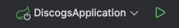
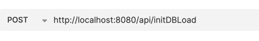
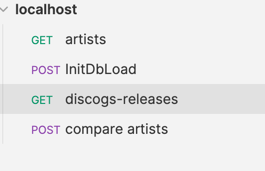
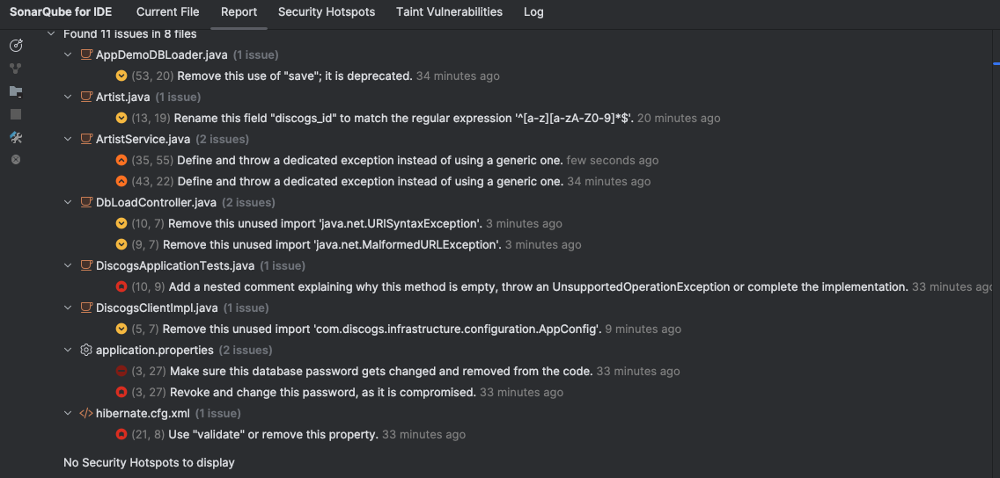

# Getting Started

### Initialize Demo Test with the App

1. clean / install the code using Maven
2. Locate main class in DiscorgsApplication
3. Start The Application

4. I used Bruno for testing APIs, so import the collection

5. Run Docker compose file to create DB and pgAdmin containers

6. Once db was created, run post http://localhost:8080/demo/initDBLoad to load database with some data for testing

7. Importing Postman collections you will see the list of endpoints, like this:

GET - http://localhost:8080/api/artists

GET - http://localhost:8080/api/discogs-release/24954

POST - http://localhost:8080/demo/initDBLoad (Empty body)

POST - http://localhost:8080/api/compare-artists (Body: [249500, 249501, 249502])

### SonarQube Analysis

### Unit Testing
As a matter of time and for some responsibilities at home, I could not add Unit Tests 

